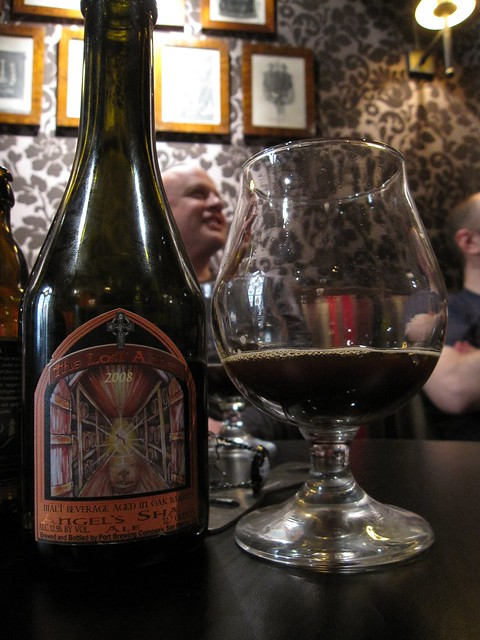

# invig-dataset

`invig-dataset` is a dataset, namely InViG, to step towards end-to-end interactive disambiguation. 

## Citation

If you find this dataset useful, please cite:

```latex
@misc{invigdataset,
    title={InViG: Interactive Visual-Language Disambiguation with 21K Human-to-Human Dialogues,
    author={Zhang, Hanbo and Mo, Yuchen and Xu, Jie and Si, Qingyi and Kong, Tao},
    howpublished = {\url{https://github.com/ZhangHanbo/invig-dataset}},
    year={2023}
}
```

## Intro

As is notoriously known, interaction based on natural language is usually ambiguous, making goal-oriented interactive tasks hard for robots to solve. Therefore, we collect 20K human-to-human disambiguation dialogues based on the images filtered from OpenImages. 

## Download

- InVig dataset can be accessed from [🤗jxu124/invig](https://huggingface.co/datasets/jxu124/invig).

    ```
    import datasets
    ds = datasets.load_datasets("jxu124/invig")
    ```

- Images (OpenImages datasets) can be accessed from [here](https://storage.googleapis.com/openimages/web/index.html). 

- A list of image IDs (a filename list) used in the InViG dataset can be obtained through this python scripts

    ```
    import os
    import datasets

    ds = datasets.load_datasets("jxu124/invig")
    file_list = [os.path.basename(i)
        for split in ['train', 'test', 'validation']
            for i in ds[split]['image_path']
    ]
    ```

## Benchmark

### End-to-End Evaluation

(AP@0.99)

|Oracle |Guesser |Questioner |Success Rate|
|-|-|-|-|
|XVLM-Oracle|Vilbert-Guesser|Vilbert-Questioner|35.3%|
|XVLM-Oracle| XVLM-Guesser| XVLM-Questioner| 40.1%|

### Guesser Evaluation

(AP@0.99) Guesser accuracy on ground-truth dialogs

|Guesser Methods| Accuracy|
|-|-|
|Vilbert-Guesser| 55.1%|
|XVLM-Guesser| 59.7%|

## Examples
> \
> Human: "Can you pour me a glass of wine?" \
> Agent: "Which one do you want?" \
> Human: "This green bottle." \
> Agent: "It has a glass of wine on the right?" \
> Human: "Yes, he has poured some." \
> Agent: `<bounding box: [16.4, 0, 208.8, 550.4]>`
